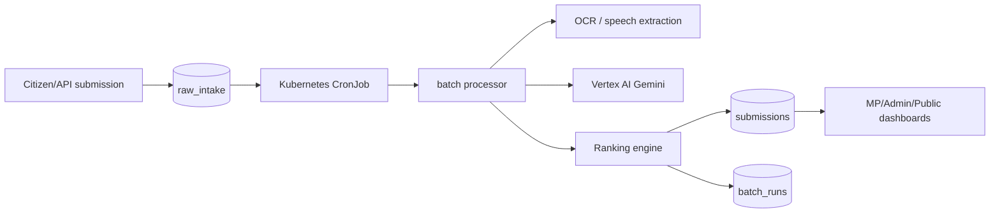

# Batch Data Pipeline

LokSetu uses batch processing for AI and scoring. Citizen-facing APIs only enqueue raw intake and return quickly. Dashboards read the latest processed batch results.

## Batch Flow



## Runtime Components

- `raw_intake`: raw text/media/location payloads waiting for processing.
- `submissions`: processed, normalized, scored, and routed civic records.
- `batch_runs`: run history with processed/failed counts.
- `services/api/src/batch.ts`: executable batch worker.
- `charts/people-priority/templates/batch-cronjob.yaml`: Kubernetes schedule.

## Commands

```bash
npm run batch
npm run build
npm run batch:prod -w services/api
```

Local Kubernetes runs the CronJob every 5 minutes through `values-local.yaml`. Production defaults to every 15 minutes.

## API Contract

`POST /api/submissions` and `POST /api/citizen/submit` return:

```json
{
  "rawIntakeId": "...",
  "status": "pending_batch",
  "message": "Submission received. It will be processed in the next scheduled batch run."
}
```

`GET /api/batch/status` returns raw queue counts and recent batch runs.

## Production Notes

- Do not call Vertex AI from the request path.
- Keep raw media in Cloud Storage for production; Postgres should store references and metadata.
- Keep batch jobs idempotent by raw intake ID.
- Alert on queue age, failed run count, and repeated failed records.
