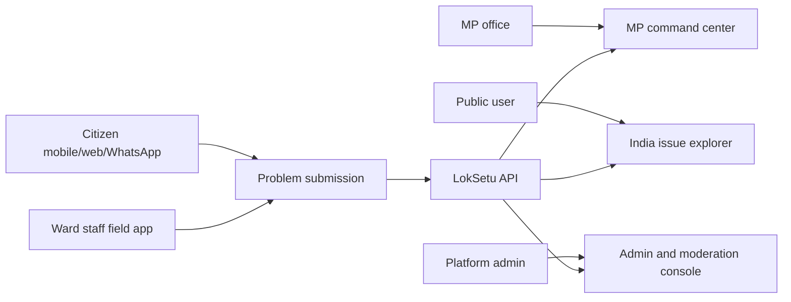
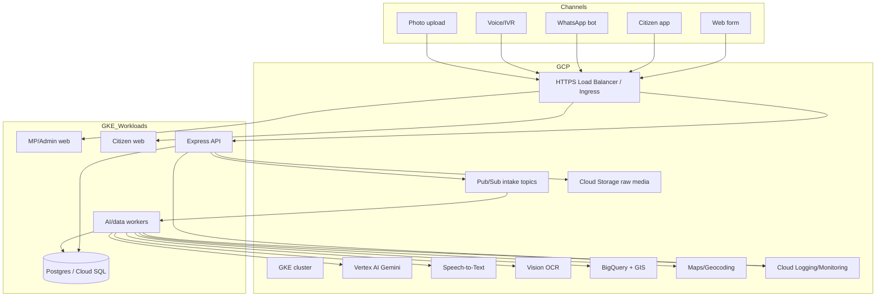
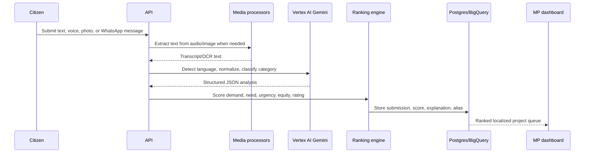
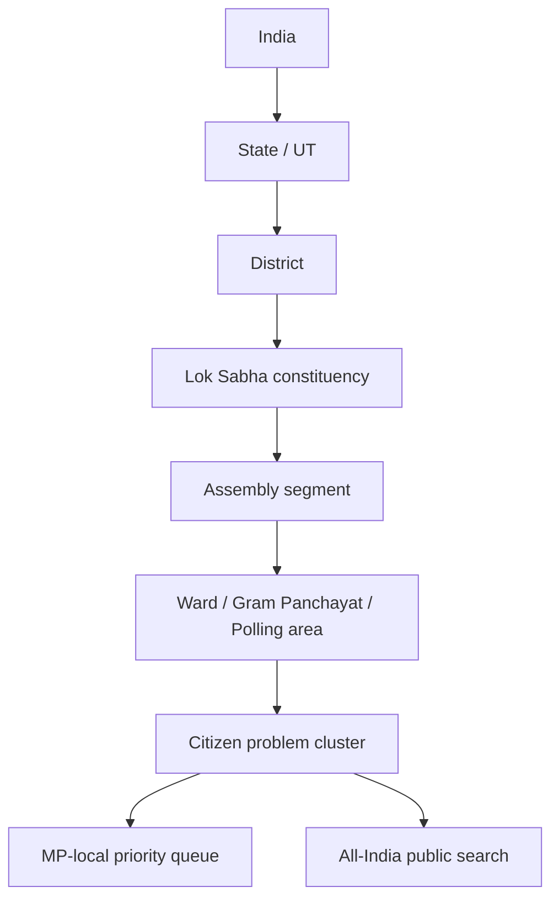
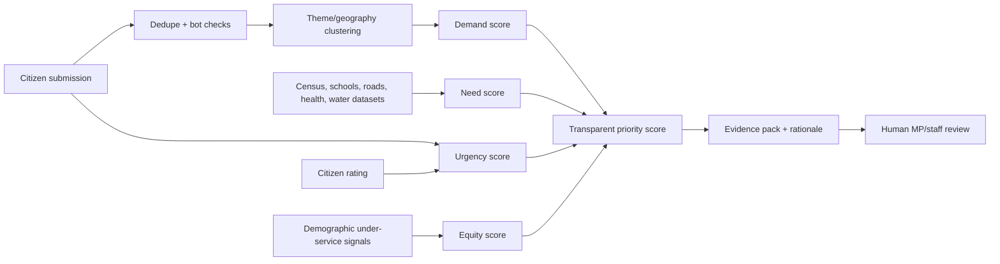
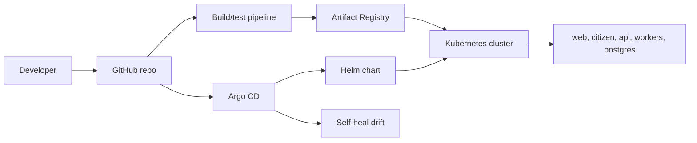
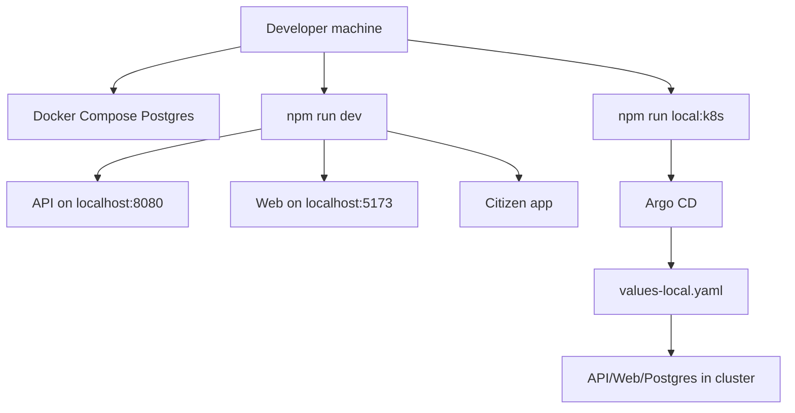
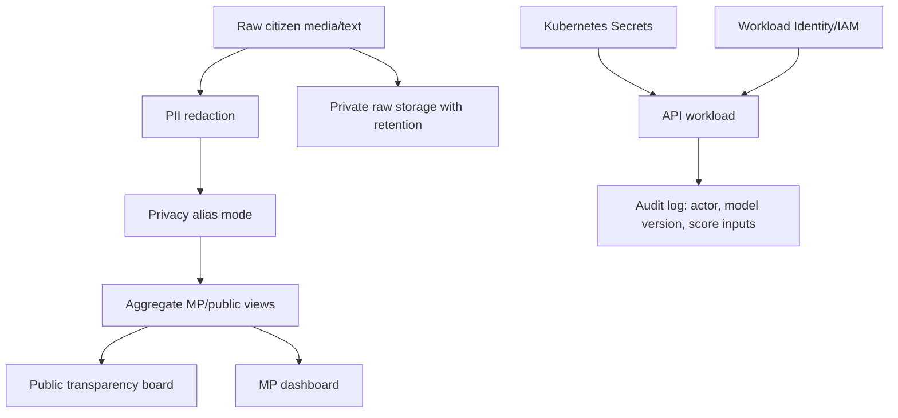

# LokSetu Architecture Diagrams

This document captures the production architecture for LokSetu: citizen intake, Vertex AI processing, India-scale ranking, MP workflows, local development, Kubernetes, and GitOps.

## 1. Product Surface

## 2. End-to-End System Architecture

## 3. AI Processing Pipeline

## 4. India Localization Model

## 5. Ranking and Evidence Flow

## 6. GitOps Deployment

## 7. Local Development Runtime

## 8. Security and Privacy Boundaries

## 9. Production Readiness Checklist

- Use managed Postgres/Cloud SQL for production instead of in-cluster local Postgres.
- Enable Workload Identity and least-privilege IAM for Vertex AI, Storage, BigQuery, and Pub/Sub.
- Run all external traffic through HTTPS ingress with WAF/rate limiting.
- Store raw media in private buckets with lifecycle retention.
- Keep all AI outputs evidence-grounded and reviewable.
- Publish public transparency data only after privacy aggregation.
- Monitor API latency, worker queue depth, model failures, sync drift, and submission anomaly spikes.
