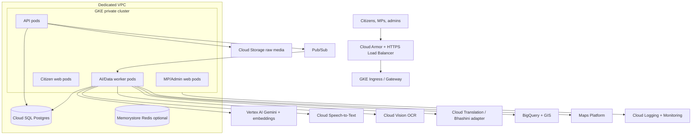
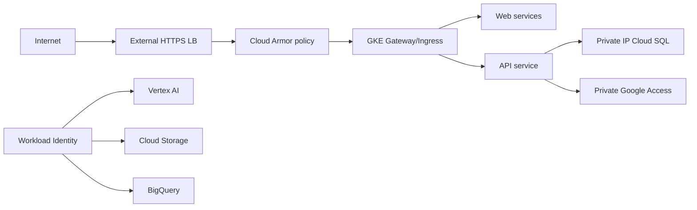
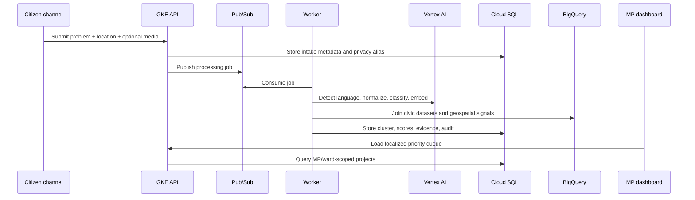
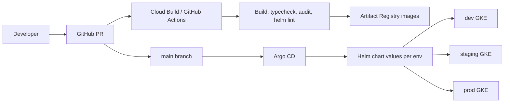

# GCP Cloud Architecture

LokSetu production runs on Google Cloud with GKE, Vertex AI, managed data services, GitOps, and private-by-default data handling.

## Target Cloud Topology

## Core Services

- **GKE private cluster**: runs API, web apps, background workers, and internal jobs.
- **Cloud SQL Postgres**: system of record for users, submissions, project clusters, scores, reviews, and audit events.
- **Pub/Sub**: durable intake queue for text, voice, photo, WhatsApp, and batch imports.
- **Cloud Storage**: raw audio, image, OCR artifacts, and lifecycle-managed evidence files.
- **Vertex AI**: language detection, normalization, classification, embeddings, clustering, and grounded summaries.
- **BigQuery + GIS**: large-scale analytics, official dataset joins, and geospatial hotspot queries.
- **Cloud Monitoring/Logging**: operational metrics, audit trails, alerts, and model failure visibility.
- **Cloud Armor + HTTPS Load Balancer**: rate limiting, WAF policy, TLS, and edge protection.

## Network and Security Design

- Use a dedicated VPC and avoid the default network.
- Use private GKE nodes and private Cloud SQL IP.
- Use Workload Identity instead of JSON service-account keys.
- Store secrets in Secret Manager and sync into Kubernetes only when needed.
- Enable VPC Flow Logs, audit logs, and Cloud Armor request logs.

## Data Flow

## Batch Processing Model

LokSetu is batch-first for AI processing. The online API stores raw intake and returns `pending_batch`; scheduled workers process pending rows, call Vertex AI, update processed tables, and refresh dashboard views. This avoids request-path latency and keeps MP dashboards stable during AI/API outages.

Recommended production schedule:

- Every 5-15 minutes for normal citizen intake.
- Hourly for heavier geospatial joins.
- Nightly for full dedupe, embeddings refresh, and official dataset reconciliation.

## GitOps and Release Architecture

Recommended environments:

- **dev**: lower-cost GKE node pool, fallback AI allowed.
- **staging**: production-like Cloud SQL, Vertex AI, Pub/Sub, and BigQuery.
- **prod**: private cluster, HA Cloud SQL, autoscaling node pools, Cloud Armor, monitored SLOs.

## Terraform Modules

Terraform should provision:

- VPC, subnets, secondary ranges for pods/services.
- Private GKE cluster and autoscaling node pools.
- Artifact Registry repositories.
- Cloud SQL Postgres with backups and private IP.
- Pub/Sub topics and subscriptions.
- Cloud Storage buckets with lifecycle policies.
- BigQuery datasets for analytics and GIS.
- IAM service accounts and Workload Identity bindings.
- Secret Manager entries for external integrations.
- Cloud Monitoring dashboards and alert policies.

## Production SLOs

- API availability: 99.9% monthly target.
- Intake API p95 latency: under 500 ms before async AI processing.
- Queue processing p95: under 5 minutes for normal text/photo submissions.
- Critical alerting: API 5xx rate, queue age, worker failure rate, Cloud SQL CPU/storage, Vertex AI error rate, Argo sync drift.

## Cost Controls

- Use async workers for expensive media/AI processing.
- Apply Cloud Storage lifecycle deletion for raw media.
- Partition BigQuery tables by date and cluster by state/district/category.
- Use autoscaling and separate node pools for CPU workers vs web/API.
- Cache public analytics and map tiles where possible.

## Disaster Recovery

- Cloud SQL automated backups and point-in-time recovery.
- Terraform state stored in a locked remote backend.
- Git as source of truth for Kubernetes manifests.
- Argo CD can restore cluster workloads from Git.
- Raw evidence stored in versioned/lifecycle-managed buckets.
