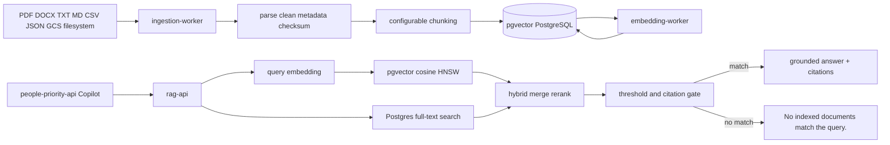

# RAG Architecture

## Storage Model

- `rag_documents`: tenant, namespace, source URI, title, checksum, metadata.
- `rag_chunks`: document chunk, page, section, metadata, checksum, tsvector.
- `rag_embeddings`: one vector per chunk, provider, model, dimensions, checksum.
- `rag_ingestion_jobs`: batch observability.
- `rag_eval_runs`: evaluation metrics.

## Retrieval

1. Generate query embedding.
2. Run pgvector cosine search.
3. Run PostgreSQL keyword search.
4. Apply tenant, namespace, and metadata filters.
5. Merge semantic and keyword hits.
6. Rerank with vector score, keyword score, and recency.
7. Enforce minimum confidence and citation requirement.
8. Assemble grounded answer from retrieved chunks only.
